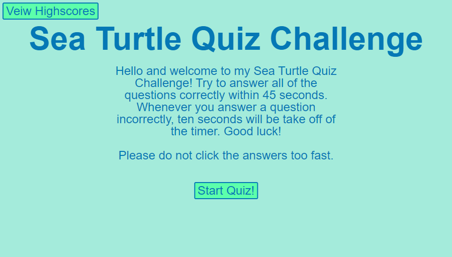

# Sea Turtle Quiz
Welcome to my Sea Turtle Quiz. This application shows off some of my skill in JavaScript, and minimal skills in CSS and HTML. It utilizes event listeners for the buttons to check whether or not you got the answer correct and it also uses intervals to display an HTML element on the screen for one second. I also used an interval to keep track of the time left on the quiz in the top right hand corner and then used that value at the end to calculate your score. When you enter your initials, the webpage stores your initials along with your score to local storage and then displays it on the high scores screen. When the high scores are cleared, they are also cleared from the local storage.

## Thank you for checking out my web page!

I really like turtles and other aquatic life, if I did better in school I probably would have been a marine biologist, so I wanted to make this website about something I really love.

